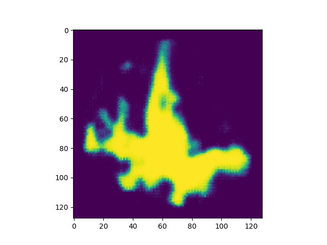

# Glacier Image Segmentation using ResNet-50

## Table of Contents

- [Introduction](#introduction)
- [Getting Started](#getting-started)
- [Prerequisites](#prerequisites)
- [Installation](#installation)
- [Usage](#usage)
- [Model Architecture](#model-architecture)
- [Dataset](#dataset)
- [Contributing](#contributing)
- [License](#license)

## Introduction


This repository contains a machine learning model for performing image segmentation on glacier images using the pre-trained ResNet-50 model with a U-Net architecture and PyTorch framework. Image segmentation is the process of classifying each pixel in an image into a specific class, which is essential for tasks like understanding glacier boundaries and ice extent.

The model leverages the power of the ResNet-50 deep neural network architecture, which has demonstrated exceptional performance in various computer vision tasks, and applies it to the specific problem of glacier image segmentation.

## Getting Started

Follow the steps below to get started with using the glacier image segmentation model:

### Prerequisites

Before you begin, ensure you have the following prerequisites:

- Python 3.6+
- PyTorch (installation instructions in the [PyTorch documentation](https://pytorch.org/get-started/locally/))
- CUDA-enabled GPU (recommended for faster training and inference)

### Installation

1. Clone this repository to your local machine:

```bash
git clone https://github.com/mattwaismann/glacier-view-analysis.git
```

2. Navigate to the project directory:

```bash
cd glacier-view-analysis
```

3. Install the required Python packages:

```bash
pip install -r requirements.txt
```

## Usage

### Training

To use the glacier image segmentation model, follow these steps:

1. Download the training data and create a training_data folder with sub-folders named images and masks.

2. Navigato to the training directory:

   ```bash
   cd src/segmentation/training/src
   ```

3. Train the model using the provided script:

    ```bash
    python train.py
    ```
4.  Navigato to the inference directory:

    ```bash
    cd src/segmentation/inference/src
    ```

6. Perform inference on new glacier images:

   ```bash
    python predict.py
    ```

   Sample output
   
   

### Inference

To infer the time-series data of a glacier and visualise its area, follow these steps:

1. Download the landsat data folder and paste it in the directory src/earth_engine/
2.  Run the following code with the desired glimsid
   ```bash
   python infer.py --glimsid G007026E45991N
   ```

## Model Architecture

The glacier image segmentation model is based on the ResNet-50 architecture. The model takes an input image of 128x128 pixels with 7 bands, and produces a segmentation mask, where each pixel is classified as glacier or non-glacier. The ResNet-50 backbone is augmented with additional layers for semantic segmentation.

## Dataset

The dataset used for training and evaluation should include glacier images along with corresponding pixel-level masks indicating glacier boundaries. Organize your dataset in the following directory structure:

```
    training_data/
    ├── images/
    └── masks/
```

## Contributing

Contributions to this repository are encouraged! If you discover issues or have suggestions for improvements, please open an issue or submit a pull request. We welcome contributions from the community.

## License

This project is licensed under ...
---

**Disclaimer:** This model and repository are designed for educational and research purposes. The performance of the image segmentation model may vary depending on your dataset and specific use cases. It is recommended to thoroughly evaluate the model's results before making critical decisions based on its output.

For inquiries, contact ...
